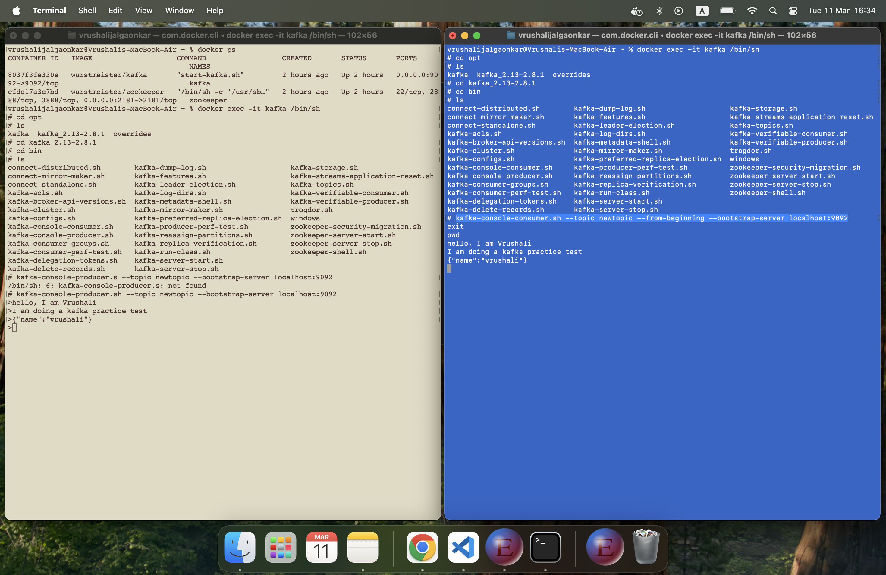

# Kafka understanding
Apache Kafka is an open-source distributed event streaming platform designed for high-throughput, fault-tolerant, and scalable real-time data streaming. It is used to handle large volumes of data and enables applications to communicate through event-driven architecture.

## Easy flow understanding:


## Kafka components
1. Producer: Publishes (writes) data to Kafka topics.
2. Topic: A category or feed where records are stored.
3. Partition: Topics are split into partitions to allow parallel processing.
4. Broker: A Kafka server that stores data and serves client requests.
5. Cluster: Group of multiple Kafka brokers working together to distribute, replicate, and manage event streaming data
6. Consumer: Reads data from Kafka topics.
7. Consumer Group: A group of consumers working together to read data.
8. Zookeeper: Manages metadata and leader election for Kafka brokers.
9. Offset: A unique identifier that tracks the position of a message within a partition

## Kafka architecture


# Why Use Kafka?
* High Throughput & Low Latency – Handles millions of messages per second.
* Scalability – Can scale horizontally by adding brokers.
* Durability & Fault Tolerance – Data is replicated across multiple brokers.
* Real-time Data Streaming – Ideal for event-driven systems.
* Decoupling of Services – Microservices use Kafka to communicate asynchronously.

## Common Use Cases
* Real-time analytics and monitoring (e.g., logs, metrics)
* Messaging systems (like a pub-sub model)
* Microservices communication
* Event-driven architecture
* ETL pipelines and data lake ingestion

## The flow of Kafka is as follows,
1. Start Zookeeper, default port = 2181
2. Start Kafka, default port = 9092
3. Create topic

# Install Kafka using Docker
**Step-1** : Create [docker-compose.yml](/docker-compose.yml)
**Step-2** : Run docker compose to pull zookeeper and kafka images
```bash
docker compose -f docker-compose.yml up -d
```
**Step-3** : Check if services are pulled successfully
```bash
docker images
```
***Expected Output:***
```bash
REPOSITORY               TAG       IMAGE ID       CREATED       SIZE
wurstmeister/kafka       latest    db97697f6e28   2 years ago   457MB
wurstmeister/zookeeper   latest    3f43f72cb283   6 years ago   510MB
```
```bash
docker ps
```
***Expected Output:***
```bash
CONTAINER ID   IMAGE                    COMMAND                  CREATED          STATUS          PORTS                                                NAMES
8037f3fe330e   wurstmeister/kafka       "start-kafka.sh"         21 minutes ago   Up 20 minutes   0.0.0.0:9092->9092/tcp                               kafka
cfdc17a3e7bd   wurstmeister/zookeeper   "/bin/sh -c '/usr/sb…"   21 minutes ago   Up 20 minutes   22/tcp, 2888/tcp, 3888/tcp, 0.0.0.0:2181->2181/tcp   zookeeper
```
**Step-4** : Enter inside kafka container
```bash
docker exec -it kafka /bin/sh
```
**Step-5** : Create new Kafka topic
> While inside kafka container go to /opt/kafka_2.13-2.8.1/bin
```bash
cd opt
```
```bash
cd kafka_2.13-2.8.1
```
```bash
cd bin
```
```bash
ls
```
***Expected Output:***
```bash
connect-distributed.sh        kafka-dump-log.sh                    kafka-storage.sh
connect-mirror-maker.sh       kafka-features.sh                    kafka-streams-application-reset.sh
connect-standalone.sh         kafka-leader-election.sh             kafka-topics.sh
kafka-acls.sh                 kafka-log-dirs.sh                    kafka-verifiable-consumer.sh
kafka-broker-api-versions.sh  kafka-metadata-shell.sh              kafka-verifiable-producer.sh
kafka-cluster.sh              kafka-mirror-maker.sh                trogdor.sh
kafka-configs.sh              kafka-preferred-replica-election.sh  windows
kafka-console-consumer.sh     kafka-producer-perf-test.sh          zookeeper-security-migration.sh
kafka-console-producer.sh     kafka-reassign-partitions.sh         zookeeper-server-start.sh
kafka-consumer-groups.sh      kafka-replica-verification.sh        zookeeper-server-stop.sh
kafka-consumer-perf-test.sh   kafka-run-class.sh                   zookeeper-shell.sh
kafka-delegation-tokens.sh    kafka-server-start.sh
kafka-delete-records.sh       kafka-server-stop.sh
```
> Now, Create a topic named **newtopic**
```bash
kafka-topics.sh --create --zookeeper zookeeper:2181 --replication-factor 1 --partitions 3 --topic newtopic
```
***Expected Output:***
```bash
Created topic newtopic.
```
**Step-6** : Start Producer
```bash
kafka-console-producer.sh --topic newtopic --bootstrap-server localhost:9092
```
**Step-7** : Start Consumer
```bash
kafka-console-consumer.sh --topic newtopic --from-beginning --bootstrap-server localhost:9092
```

## Demo video

<a href="https://youtu.be/3rBnux1mjH4">
  
</a>


